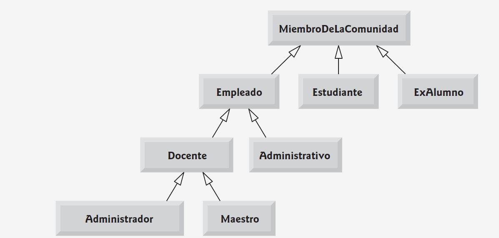

# Sistema de Gestión de Comunidad Académica

## Descripción

Este proyecto en C# implementa un sistema completo para gestionar una comunidad académica, que incluye estudiantes, ex-alumnos y personal administrativo. El sistema aprovecha conceptos fundamentales de la Programación Orientada a Objetos (POO) como herencia, polimorfismo, encapsulación y sobrecarga de métodos, para proporcionar funcionalidades avanzadas de administración, registro y reporte de información académica y laboral.

---

## Mapa de Clases

---

## Tecnologías utilizadas

- Lenguaje: C#  
- Plataforma: .NET (compatible con versiones modernas de .NET Core o .NET Framework)  
- Conceptos: Programación Orientada a Objetos, Colecciones genéricas, LINQ para consultas y estadísticas

---

## Cómo ejecutar

1. Clona o descarga este repositorio.  
2. Abre el proyecto en un entorno compatible con C# (Visual Studio, Visual Studio Code con extensión C#, JetBrains Rider, etc.).  
3. Compila y ejecuta el programa.  
4. Observa la salida en la consola, donde se muestran los procesos y resultados de la gestión de la comunidad académica.
